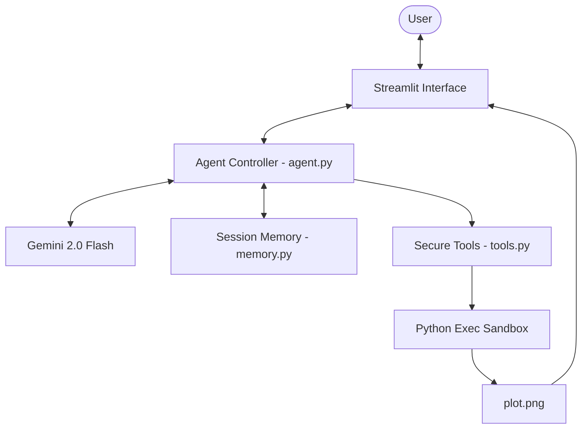

# Project Report: Agentic Data Analyst (COMPSCI 767)

**GitHub Repository**: [https://github.com/jjtjzj/Data-Analysis-Agent](https://github.com/jjtjzj/Data-Analysis-Agent)

---

## 📄 Page 1: System Design & Architecture

### 1. Problem Definition & Motivation
Analyzing raw datasets typically requires specialized knowledge of programming (Python/Pandas) and statistics. For non-technical stakeholders, this creates a barrier to data-driven decision-making. 

The **Agentic Data Analyst** is designed to bridge this gap. An *agentic* approach is superior to a standard chatbot because:
*   **Goal-Directed Action**: The agent doesn't just talk; it *acts* by writing and executing code to find answers.
*   **Self-Correction**: Unlike static bots, this agent observes its own failures (tracebacks) and autonomously corrects its strategy.
*   **Tool Use**: It interacts with a sandboxed environment, managing files and generating visualizations dynamically.

### 2. System Architecture
The system is built on a modular architecture that separates the "Brain" (LLM) from the "Hands" (Tools) and "Memory."

**Major Components:**
*   **Agent Controller (`agent.py`)**: Manages the ReAct loop (Reason-Act-Observe). It parses LLM responses and directs the flow of information.
*   **Secure Tools (`tools.py`)**: A restricted execution environment that prevents unauthorized system access while allowing complex data manipulation and plot interception.
*   **Memory (`memory.py`)**: A stateful storage system that tracks conversation history and "Reasoning Logs" for UI transparency.
*   **User Interface**: A dual-pane Streamlit dashboard that balances human conversation with technical transparency.

### 3. Agentic Behavior
The system demonstrates advanced agentic behavior through its **ReAct Loop**:
1.  **Thought**: The agent interprets the user's intent and plans a technical approach.
2.  **Action**: It selects and uses the Python tool to interact with the data environment.
3.  **Observation**: It reads the tool's output (or error) and updates its internal state.
4.  **Correction**: If an error is detected, the agent initiates a self-correction sub-routine, re-evaluating its plan based on the traceback.

---

## 📄 Page 2: System in Action & Evaluation

### 1. How the System Works
The system provides a high-fidelity "glass-box" experience. When a user asks a question, the following sequence occurs:

1.  **Initialization**: The agent reads the dataframe schema (columns, types) to understand its environment.
2.  **Reasoning**: It generates a "Thought" (e.g., *"I need to group by 'Department' and find the mean of 'Salary'"*).
3.  **Execution**: It writes and runs the code. If successful, the output is displayed.
4.  **Visualization**: If the code includes plotting commands, the system intercepts the `matplotlib` output, saves it as `plot.png`, and renders it in the chat.

### 2. Implementation Quality & Testing
The implementation goes beyond simple prompting by incorporating:
*   **Error Handling**: A `while` loop that allows up to 5 attempts to reach a correct solution.
*   **Sandbox Security**: Restricted `__builtins__` to prevent malicious code execution (e.g., `os.system`).
*   **Visual Feedback**: Real-time status indicators and color-coded reasoning logs.

**Testing Evidence**:
*   **Success Case**: The agent correctly identified the top 3 highest-earning departments and plotted them in a bar chart during verification.
*   **Self-Correction Case**: When asked for a column that was slightly misspelled, the agent caught the `KeyError`, listed the available columns, and corrected its code automatically.

### 3. Critical Reflection
**Limitations**:
*   **Context Window**: Extremely large datasets with many columns might exceed the initial context provided to the LLM.
*   **Library Support**: The current sandbox is restricted to Pandas and Matplotlib.

**Design Trade-offs**:
*   **Security vs. Flexibility**: By restricting built-ins, I sacrificed some advanced Python features to ensure the host system's safety.

**Future Improvements**:
*   **Multi-File Support**: Allowing the agent to merge multiple CSV files.
*   **Advanced Planning**: Implementing a dedicated "Planner" step for multi-part questions (e.g., "Analyze, then plot, then save to PDF").

---

### 🎥 Demo Explanation
In the recorded demo, the agent is shown processing a university salary dataset. 
1.  **Step 1**: The user asks for a salary distribution plot.
2.  **Step 2**: The agent's "Thought" process explains its choice of a histogram.
3.  **Step 3**: The code is executed, and the chart appears instantly.
4.  **Step 4**: The agent provides a final natural-language summary of the visual data.
